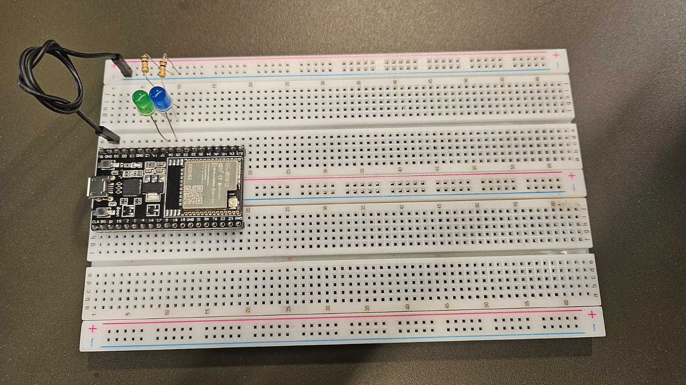
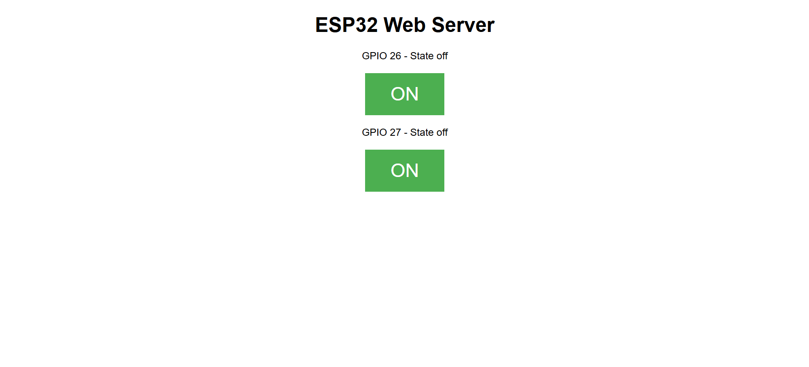

# Atividade Ponderada de Programação
### Grupo 1 - Integrantes:

- <a href="https://www.linkedin.com/in/danielaraujogon%C3%A7alves/">Daniel Augusto de Araújo Gonçalves</a>
- <a href="https://www.linkedin.com/in/giovanna-britto/">Giovanna Fátima de Britto Vieira</a>
- <a href="https://www.linkedin.com/in/gucolombini/">Gustavo Colombini</a> 
- <a href="https://www.linkedin.com/in/isadoragatto/">Isadora Tribst Gatto</a> 
- <a href="https://www.linkedin.com/in/karine-victoria/">Karine Victoria Rosa da Paixão</a>
- <a href="https://www.linkedin.com/in/lucas-ramenzoni-jorge-083770302/">Lucas Ramenzoni Jorge</a> 
- <a href="https://www.linkedin.com/in/sophia-emanuele-de-senne-silva/">Sophia Emanuele de Senne Silva</a>

## Instruções

Neste encontro, após apresentação de uma visão geral de vulnerabilidades, riscos e contramedidas de segurança da informação em IoT, será realizada uma atividade de pentest de uma solução IoT.


Atenção: Atividade Ponderada em Sala.

Roteiro

1. Abrir o exemplo de servidor web local embutido no ESP32: https://randomnerdtutorials.com/esp32-web-server-arduino-ide/

2. Realizar uma análise estática do código para identificar as vulnerabilidades (pontos fracos) e possíveis ataques (pelo menos dois ataques diferentes)

3. Para cada um dos dois ataques, descreva seu passo-a-passo, a probabilidade de cada ataque ocorrer, o seu impacto estimado e o risco resultante (com justificativas)

4. Consolide suas análises e resultados em um relatório técnico, organizando os itens solicitados

5. Todos os grupos devem elaborar uma tabela consolidada dos ataques e ordenar os ataques desta tabela de forma decrescente (do maior risco para o menor risco). Cada ataque deve ter um título representativo, e a tabela deve ter título do ataque, probabilidade, impacto e risco como colunas.

6. (Ir além) Realize a montagem em protoboard conforme o tutorial online, compile o código com o Arduino IDE e realize o teste de um ataque no ESP32 de forma manual (análise dinâmica). Registre seus resultados com capturas de tela e fotos (e explicações textuais associadas) no relatório técnico

---

### Análise Estática do Código

A análise estática consiste em revisar o código fonte para identificar possíveis vulnerabilidades e pontos fracos, sem executá-lo. No caso do [código]() apresentado, foram detectados os seguintes problemas de segurança e aspectos técnicos:


#### **1. Credenciais Expostas no Código**
- **Descrição:**
  - As credenciais do Wi-Fi (`ssid` e `password`) estão declaradas diretamente no código-fonte. 
  - Isso expõe informações sensíveis a qualquer pessoa que tenha acesso ao arquivo, permitindo a conexão não autorizada à rede Wi-Fi.
- **Impacto:**
  - Compromete a segurança da rede Wi-Fi, possibilitando acesso indevido por terceiros.

#### **2. Comunicação Não Segura (HTTP)**
- **Descrição:**
  - A comunicação entre cliente e servidor utiliza o protocolo HTTP. Este protocolo não criptografa os dados, tornando-os vulneráveis à interceptação.
  - Exemplos de informações que podem ser capturadas incluem comandos enviados para os pinos GPIO.
- **Impacto:**
  - Um atacante pode realizar ataques de interceptação de tráfego (Man-in-the-Middle - MiTM) para roubar informações ou injetar comandos maliciosos.

#### **3. Falta de Validação das Entradas**
- **Descrição:**
  - O servidor aceita qualquer requisição HTTP sem verificar sua origem ou legitimidade.
  - Isso permite que comandos maliciosos sejam injetados no cabeçalho HTTP para manipular o comportamento do ESP32.
- **Impacto:**
  - Pode levar a execução de comandos não autorizados ou acesso indevido aos GPIOs.

#### **4. Ausência de Controle de Acesso**
- **Descrição:**
  - Não há nenhum mecanismo de autenticação ou autorização implementado no servidor.
  - Qualquer cliente pode acessar a página e enviar comandos para controlar os GPIOs.
- **Impacto:**
  - Usuários mal-intencionados podem manipular os GPIOs do ESP32 sem restrição.

#### **5. Dados Sensíveis Não Criptografados**
- **Descrição:**
  - As informações sensíveis, como estados dos GPIOs, são transmitidas em texto claro.
  - Isso torna os dados vulneráveis a interceptação durante a transmissão.
- **Impacto:**
  - Permite a captura e possível modificação dos dados em trânsito por um atacante.

#### **6. Implementação Simples do Servidor**
- **Descrição:**
  - O servidor embutido no ESP32 é simples e não possui funcionalidades robustas para mitigar ataques.
  - Exemplos incluem proteção contra força bruta, limitação de requisições ou logs de auditoria.
- **Impacto:**
  - Pode levar a sobrecarga do sistema (DoS - Denial of Service) ou à exploração contínua de vulnerabilidades.


### **Resumo das Vulnerabilidades Identificadas**

| **Vulnerabilidade**  | **Impacto**   | **Solução Recomendada**    |
|---------------|---------------|-----------------------------------|
| Credenciais expostas no código        | Compromete segurança da rede    | Armazenar credenciais de forma segura                    |
| Comunicação não segura (HTTP)         | Interceptação de dados          | Migrar para HTTPS com SSL/TLS                            |
| Falta de validação das entradas       | Manipulação de comandos         | Validar origem e legitimidade das requisições            |
| Ausência de controle de acesso        | Controle indevido dos GPIOs     | Implementar autenticação/autorização                    |
| Dados sensíveis não criptografados    | Interceptação de informações    | Utilizar criptografia para dados em trânsito             |
| Simplicidade do servidor              | Vulnerabilidade a ataques DoS   | Implementar logs, limitação de conexões e proteção extra |

--- 

### Análise de Possíveis Ataques
A partir das vulnerabilidades detectadas na análise estática, foram identificados os seguintes ataques que podem ser explorados por um atacante mal-intencionado:

#### **1. Ataque de Interceptação de Dados (Man-in-the-Middle - MiTM)**

- **Descrição do Ataque:**
  - Este ataque explora a ausência de criptografia no tráfego HTTP entre o cliente e o servidor. 
  - Um atacante pode posicionar-se entre o ESP32 e o cliente (navegador ou dispositivo) para interceptar, modificar ou capturar os dados transmitidos.

**Passo a Passo para Executar o Ataque:**
1. **Configurar um ponto de acesso falso (Evil Twin):**
   - Criar uma rede Wi-Fi com o mesmo nome (SSID) utilizado pelo ESP32.
   - Ferramentas como **airbase-ng** do pacote Aircrack podem ser usadas para configurar esse ponto de acesso.
   
2. **Forçar dispositivos a se conectarem ao Evil Twin:**
   - Enviar pacotes de desautenticação para desconectar o ESP32 da rede original e redirecioná-lo para o Evil Twin.

3. **Capturar o tráfego HTTP:**
   - Utilizar ferramentas como **Wireshark** ou **Ettercap** para interceptar as requisições HTTP.
   - Ler informações sensíveis (exemplo: comandos enviados ao ESP32 ou outras informações trafegadas em texto claro).

**Probabilidade de Ocorrer:**
- **Alta.**
  - Requer apenas acesso físico ou próximo ao local da rede Wi-Fi.
  - Ferramentas para criar Evil Twins e capturar pacotes são amplamente disponíveis.

**Impacto Estimado:**
- **Alto.**
  - Dados sensíveis podem ser comprometidos, como comandos para dispositivos conectados.
  - A integridade do sistema também pode ser afetada.

**Risco Resultante:**
- **Alto.**
  - Combinação de alta probabilidade e impacto faz desse ataque uma das vulnerabilidades mais críticas.

#### **2. Controle Não Autorizado dos GPIOs**

- **Descrição do Ataque:**
  - Este ataque explora a ausência de autenticação e controle de acesso no servidor do ESP32. 
  - Qualquer cliente pode acessar o servidor e enviar comandos para manipular os pinos GPIO.

**Passo a Passo para Executar o Ataque:**
1. **Descobrir o endereço IP do ESP32:**
   - Conectar à mesma rede Wi-Fi do ESP32.
   - Usar comandos como `arp -a` no terminal para listar os dispositivos conectados e encontrar o ESP32 pelo MAC address ou nome.

2. **Enviar comandos HTTP diretamente:**
   - Utilizar ferramentas como o **curl** ou um navegador para enviar requisições ao ESP32.
   - Exemplo de comandos:
     - `curl http://<IP_DO_ESP>/26/on` para ligar o GPIO 26.
     - `curl http://<IP_DO_ESP>/27/off` para desligar o GPIO 27.

3. **Observar a execução do comando:**
   - O ESP32 processa as requisições e altera o estado dos pinos GPIO sem autenticação.

**Probabilidade de Ocorrer:**
- **Média.**
  - Requer que o atacante esteja na mesma rede Wi-Fi do ESP32 ou tenha acesso físico à rede.

**Impacto Estimado:**
- **Médio.**
  - Um atacante pode causar mau funcionamento do sistema, como ligar ou desligar dispositivos conectados aos GPIOs. No entanto, o impacto depende da criticidade dos dispositivos controlados.

**Risco Resultante:**
- **Médio.**
  - Apesar de a probabilidade ser moderada, o impacto pode variar dependendo do sistema conectado.


#### **3. Ataque de Força Bruta no Servidor**

- **Descrição do Ataque:**
  - O servidor ESP32 não possui limitação de conexões simultâneas ou proteção contra repetição de requisições. Isso pode ser explorado para sobrecarregar o servidor, causando lentidão ou indisponibilidade.

**Passo a Passo para Executar o Ataque:**
1. **Descobrir o endereço IP do ESP32:**
   - Conectar à mesma rede Wi-Fi.
   - Utilizar o comando `arp -a` para identificar dispositivos conectados na rede e localizar o ESP32.

2. **Automatizar requisições HTTP:**
   - Criar um script em Python ou utilizar ferramentas como **Hydra** para enviar múltiplas requisições HTTP ao ESP32.
   - Configurar o script para alternar entre diferentes endpoints, como `/26/on`, `/26/off`, etc., em alta frequência.

3. **Observar o comportamento do servidor:**
   - Monitorar se o ESP32 começa a apresentar lentidão ou falhas ao processar novas requisições devido à sobrecarga.

**Probabilidade de Ocorrer:**
- **Média.**
  - Requer que o atacante tenha acesso à mesma rede e ferramentas básicas de automação.

**Impacto Estimado:**
- **Médio.**
  - O servidor pode ficar indisponível, interrompendo o funcionamento do sistema.

**Risco Resultante:**
- **Médio.**
  - A combinação de probabilidade moderada e impacto médio indica um risco relevante.

#### **4. Injeção de Comandos via Cabeçalho HTTP**

- **Descrição do Ataque:**
  - O código do ESP32 concatena o cabeçalho HTTP recebido (`header`) sem realizar sanitização ou validação das entradas, permitindo a injeção de comandos maliciosos.

**Passo a Passo para Executar o Ataque:**
1. **Identificar endpoints vulneráveis:**
   - Capturar requisições HTTP enviadas ao ESP32 utilizando ferramentas como **Wireshark** ou **Burp Suite**.

2. **Criar cabeçalhos HTTP maliciosos:**
   - Modificar os cabeçalhos HTTP para incluir comandos inesperados. Por exemplo:
     ```http
     GET /26/on HTTP/1.1
     Injected-Header: shutdown
     ```

3. **Enviar a requisição modificada:**
   - Utilizar ferramentas como **curl** ou **Postman** para enviar as requisições ao ESP32.

4. **Observar a resposta:**
   - Verificar se o ESP32 processa o cabeçalho malicioso e executa o comando injetado.

**Probabilidade de Ocorrer:**
- **Média.**
  - Requer que o atacante tenha acesso ao endereço IP do ESP32 e conheça a estrutura dos cabeçalhos HTTP.

**Impacto Estimado:**
- **Alto.**
  - Permite a execução de comandos arbitrários, podendo comprometer gravemente o funcionamento do sistema.

**Risco Resultante:**
- **Alto.**
  - A combinação de impacto alto com probabilidade moderada resulta em um risco significativo.

#### **5. Ataque de Descoberta de Credenciais**

- **Descrição do Ataque:**
  - Este ataque explora o fato de as credenciais de Wi-Fi (`ssid` e `password`) estarem visíveis no código-fonte. Um atacante pode obter essas informações se o firmware do ESP32 for acessado.

**Passo a Passo para Executar o Ataque:**
1. **Obter acesso ao firmware do ESP32:**
   - Utilizar ferramentas como **esptool.py** para fazer um dump do firmware carregado no ESP32.

2. **Analisar o firmware:**
   - Abrir o firmware em um editor de texto ou ferramentas de análise binária para localizar as credenciais expostas (exemplo: `ssid` e `password`).

3. **Utilizar as credenciais:**
   - Conectar à rede Wi-Fi utilizando as credenciais encontradas.

**Probabilidade de Ocorrer:**
- **Baixa.**
  - Requer acesso físico ao dispositivo ou ao código-fonte.

**Impacto Estimado:**
- **Alto.**
  - Permite ao atacante comprometer a rede Wi-Fi e outros dispositivos conectados.

**Risco Resultante:**
- **Médio.**
  - Apesar do alto impacto, a necessidade de acesso físico reduz a probabilidade e, consequentemente, o risco.


A partir dessas definições é possível resumir os ataques de acordo com o tipo, probabilidade, impacto, risco e justificatica, conforme consta na tabela abaixo.

| **Ataque**                          | **Probabilidade** | **Impacto** | **Risco** | **Justificativa**                                   |
|-------------------------------------|-------------------|-------------|-----------|---------------------------------------------------|
| Interceptação de Dados (MiTM)       | Alta              | Alto        | Alto      | Comunicação HTTP e falta de HTTPS permitem fácil interceptação. |
| Controle Não Autorizado dos GPIOs   | Média             | Médio       | Médio     | Ausência de autenticação exige estar na mesma rede para executar o ataque. |
| Ataque de Força Bruta no Servidor   | Média             | Médio       | Médio     | Sobrecarga do servidor é viável, mas exige acesso à rede. |
| Injeção de Comandos via HTTP Header | Média             | Alto        | Alto      | Permite execução de comandos arbitrários, comprometendo o sistema. |
| Descoberta de Credenciais           | Baixa             | Alto        | Médio     | Impacto elevado, mas probabilidade reduzida devido à necessidade de acesso físico. |

---

Com base em todas as definições anteriores é possível resumir os ataques e ordená-los a partir dos riscos, conforme determinado na seguinte tabela. 

### Tabela Com os Ataques Ordenados

| **Título Representativo do Ataque** | **Probabilidade** | **Impacto** | **Risco** | **Justificativa** |
|-------------------------------------|-------------------|-------------|-----------|---------------------------------------------------|
| Interceptação de Dados (MiTM)       | Alta              | Alto        | Alto      | Comunicação HTTP e falta de HTTPS tornam o ataque fácil de realizar, com graves consequências. |
| Injeção de Comandos via HTTP Header | Média             | Alto        | Alto      | Permite a execução de comandos arbitrários devido à falta de validação no cabeçalho HTTP. |
| Controle Não Autorizado dos GPIOs   | Média             | Médio       | Médio     | Ausência de autenticação permite acesso indevido aos GPIOs, mas requer estar na mesma rede. |
| Ataque de Força Bruta no Servidor   | Média             | Médio       | Médio     | A sobrecarga do servidor pode causar indisponibilidade, mas exige acesso à rede. |
| Descoberta de Credenciais           | Baixa             | Alto        | Médio     | Exige acesso físico ou ao código-fonte, mas o impacto é significativo devido ao comprometimento da rede. |

---

### Montagem do Circuito 

Conforme demonstrado no site, foi possível realizar a seguinte montagem do circuito:



Com base nesse circuito e realizando os passos propostos, obtivemos o endereço da conexão e acessamos a seguinte página:



A partir dela foi possível ligar e desligar o Led, conforme consta nos seguintes vídeos:

[Vídeo 1](https://drive.google.com/file/d/1BLWhhBfvTxW3Cj9Gu8PeeinLlEuU-SWB/view?usp=sharing)

[Vídeo 2](https://drive.google.com/file/d/163sWmkJkZqnnix9_n_agAmMRrwW1ryii/view?usp=sharing)


A partir desse protótipo, foi possível fazer a simulação de um ataque de controle não autorizado dos GPIO's, por meio dos seguintes passos:


**Realização do Ataque (Controle Não Autorizado dos GPIOs)**

1. **Etapa 1 - Obter o Endereço IP do ESP32:**
   - Por meio do monitor serial da Arduino IDE foi possível obter o endereço IP do ESP32 (`192.168.73.108`).

2. **Etapa 2 - Enviar Comandos HTTP Diretos:**
   - Utilizando o PowerShell foi possível enviar requisições ao ESP32, como os seguintes comandos:
   - Comando para ativar o GPIO 26:
     ```bash
     curl http://192.168.73.108/26/on
     ```
   - Comando para desativar o GPIO 26:
     ```bash
     curl http://192.168.73.108/26/off
     ```

3. **Etapa 3 - Observação do Resultado no Circuito:**
   - [Vídeo Comprovando os Testes](https://drive.google.com/file/d/1vyLIpJJPGos9jTkD6MLnI1AArOgSDBqr/view?usp=sharing)

Por meio do vídeo é possível notar os seguintes resultados:

1. **Resposta do Servidor:**
   - O servidor processou os comandos enviados diretamente via HTTP.
   - Resposta exibida no terminal confirmando a execução do comando.

2. **Mudanças no Circuito:**
   - O LED no GPIO 26 acendeu ao receber o comando `GET /26/on`.
   - O LED no GPIO 27 apagou ao receber o comando `GET /27/off`.

## Anexos

* [Drive com Vídeos](https://drive.google.com/drive/folders/1GScMwU4xBoOjCzj3FSlSAKa_HsZ6Pdot?usp=sharing)

* [Código do Projeto](./src/sketch.ino)
